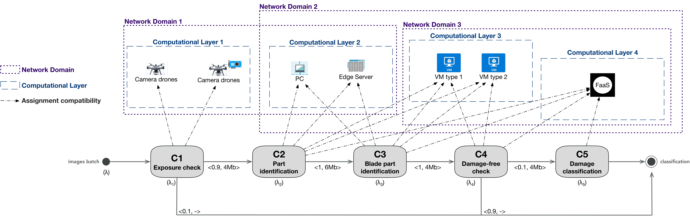

# SPACE4-AI Design Time

## Introduction
SPACE4-AI is a tool that tackles the component placement resource selection problem in the computing continuum at design-time, while dealing with different application requirements and constraints. The need for this kind of tools starts from the rise of edge computing, a model that deploys computing and storage power through several devices with different capacities. This work will contribute to the AI-SPRINT project, a Research and Innovation Action co-funded by the European Commission, H2020 Programme.

It exploits an efficient randomized greedy algorithm that identifies the placement, minimizing a certain loss, across heterogeneous resources including edge devices, cloud GPU-based Virtual Machines and Function as a Service solutions, under Quality of Service (QoS) response time constraints.

|  |
|:--:|
| <b>Use Case: maintenance and inspection of a wind farm</b>|

## Dependencies

> :exclamation: We provided indications for ```Ubuntu``` machines, but the flow should be quite similar for any ```UNIX``` distribution, adapting some installation commands. If you use ```Windows``` or you encounter any problem during dependencies installation (or the subsequent compilation process), we suggest to use the library through a ```Docker``` container (further information in the [dedicated](#docker-container) section).

### pybind11
To use our library you have to install [pybind11](https://github.com/pybind/pybind11). You could refer to the original documentation for the installation but, since it can be tricky to understand which is the correct way to go, we strongly suggest you to perform the following steps.

First of all, please update your system to have the latest versions of the compilers, libraries and so on. Then make sure to have **cmake 3.16.3** or above installed. Moreover, you also ought to have **Python 3.7** or above. After that you need to install **python3-dev** packages, for which you can do
```bash
sudo apt-get install -y python3-dev
```
Now you can install pybind11 using the pip wheel:
```bash
pip3 install "pybind11[global]"
```

### pacsltk
If you successfully installed pybind11, you can move to install the [pacsltk](https://github.com/pacslab/serverless-performance-modeling) package.

```bash
pip3 install pacsltk
```

### OpenMP
If moreover, you will use the parallel version of the library, you need to have the **OpenMP** installed. In general, most modern compilers provide support for OpenMP. If you are using gcc, you can check the configuration by running
```bash
echo |cpp -fopenmp -dM |grep -i open
```

If OpenMP is not featured in the compiler, you can configure it using the command
```bash
sudo apt install libomp-dev
```

### Json for Modern C++

This is a *json* parser, which consists in just an header file so no particular installation procedure is needed. In our repository such header file is saved in  ```external/nlohmann```. For further information on the usage of the library refer directly to the original [documentation](https://json.nlohmann.me/).

## Compile the library
After you have installed the dependencies, clone this repository and enter the source root. Then create a *build* sub-folder and navigate to it
```bash
mkdir build && cd build
```
Now you can generate the *Makefile* through the build system *cmake*:
```bash
cmake ..
```
By default, this will generate a Makefile to compile the RELEASE mode, SERIAL version, creating a SHARED library. For any other combination, we describe the most important *cmake* variables you can set:
- CMAKE_BUILD_TYPE (string). Specifies the build type, which can be ```Debug```, ```Release```, ```RelWithDebInfo``` or ```RelWithDebInfo```. Please refer to the original [documentation](https://cmake.org/cmake/help/latest/), for further information.
- PARALLELIZATION (option). If set to ON, it will compile the parallel version of the library; otherwise it will be serial.
> :warning: The Parallelization is **not** supported if there is the need to call Python functions during the construction of the solution through the algorithm (see **GIL ISSUE** on the report). If you try to go parallel in this situation, the code will automatically ignore the requested threads, and will run in serial (a warning message will pop out).

- SHARED (option). If set to OFF, it will create a static library instead of shared one.

So, for instance, if you want to compile for DEBUG, in PARALLEL mode, creating STATIC library, you would do:
```bash
cmake -DCMAKE_BUILD_TYPE=Debug -DPARALLELIZATION=ON -DSHARED=OFF ..
```

After you have generated the Makefile, you are ready to compile the library by doing:
```bash
make VERBOSE=1
```
Eventually, to ensure that everything went well, do
```bash
make test
```
to run a bunch of tests, checking the correct compilation of the library and installation of the dependencies.
If some tests go wrong, run the tests in VERBOSE mode to understand the problem.
```bash
ctest --verbose
```

> :hammer_and_wrench: At the moment we did not provide instruction for the installation of our library, mainly because it is still under development and the its usage as standalone is perfectly fine. So at this stage, it is pointless to manage the installation too.

## Docker container

If you have any problem installing dependencies or compiling the library correctly, you can use [Docker](https://docs.docker.com/) virtualization.

First, pull the [image](https://hub.docker.com/r/randosrandom/space4ai) from the Docker Hub
```bash
docker pull randosrandom/space4ai
```
Then create a container
s


Once you created the container you can use it

```bash
docker start -i <CONTAINER_NAME>
```

Note that, at the moment of the creation of the image, the code is compiled following the default explained above. To be sure that everything will work properly, the first time you start the container please do a
```bash
make test
```
from the ```build``` folder,  and check if it passes all the tests.

Moreover, if you need a different building configuration, you can recompile the library in the container.

Note that, working with a Docker container requires to extract files form the container to the host most of the time. For this we suggest you to use Docker [bind mounts](https://docs.docker.com/storage/bind-mounts/). If instead you have superuser permissions, you might prefer [volumes](https://docs.docker.com/storage/volumes/).

## Usage

In the ```config``` folder are stored both the system description files and the input *.json* files requested by our main executable, namely ```dt_solver```. In particular, the input has the following structure:
```json
{
  "ConfigFiles" : [
    "config/LargeScale/5-components/instance1/system_description1.json",
    "config/LargeScale/15-components/instance10/system_description10.json"
  ],

  "Algorithm" : {
    "n_iterations" : 5000,
    "max_num_sols" : 1,
    "reproducibility": false
  },

  "Logger" : {
    "priority" : 5,
    "terminal_stream" : false,
    "file_stream" : false
  }
}
```
- **ConfigFiles**: list of system descriptions you want to solve. Note that the relative path, with respect to the root folder of the project, must be given for each system file; we do not provide details about the systems configuration files structure since it is quite intuitive.

- **Algorithm**: Here you can set the total number of iterations to request, the number of top solutions to retain, and decide whether to obtain reproducible results, which can be useful for debug or analysis, or go just random, as generally done in practice.

- **Logger**: configure Logger messages
  - *priority*: 0 is the lowest priority (print everything possible, useful for hard debugging), 5 is the highest priority (print only the critical errors).

  - *terminal_stream*: set to true if you want to have the messages printed on the terminal, false otherwise.

  - *file_stream*: set to true if you want to have logger messages saved to file. Note that this will automatically create a folder named ```logs``` in the same location of the executable.

In the config folder, there is an input file called ```config_dt_solver.json``` which you can modify (or you can create a new one from scratch).

Once you have built the library and configured the input files as you wish, from the ```build``` folder navigate to
```bash
cd apps
```
where you will find (other than building files) a symbolic link to the ```config``` folder introduced above. Now you can launch the solver by doing
```bash
./dt_solver config/config_dt_solver.json
```

If instead, you are using the parallel version, you can set the total number of threads by either exporting the following environmental variable
```bash
export OMP_NUM_THREADS=<NUM_THREADS>
```
or you can change it just for the specific executable launch
```bash
OMP_NUM_THREADS=<NUM_THREADS> ./dt_solver config/config_dt_solver.json
```

After the run, you will find a folder called ```OutputFiles```, in which there will be saved the solutions and some additional files containing the most important information about the saved solutions (like the cost, the number of threads used, the computing time etc...).

### Custom applications

If you need to built an application from scratch and use the library, you just have to

```cpp
#include "src/s4ai.hpp"
```
to include all the needed header files in your application.

Moreover, to initialize (and finalize) the Python interpreter you need to do the following before initializing the system
```cpp
pybind11::scoped_interpreter guard{};
```
This initializer also takes care of the destruction of the objects, and it saves you from creating multiple concurrent interpreters (forbidden by the Python GIL).

Furthermore, if you want to create a new system description file, we suggest to pick any system configuration file from the folder ```config```, and follow it to build a new one.

## References

<a id="1">[1]</a>
AI IN SECURE PRIVACY-PRESERVING COMPUTING CONTINUUM, 2021. https://www.ai-sprint-project.eu/

<a id="2">[2]</a>
H. Sedghani, F. Filippini and D. Ardagna, "A Random Greedy based Design Time Tool for AI Applications Component Placement and Resource Selection in Computing Continua," 2021 IEEE International Conference on Edge Computing (EDGE), 2021, pp. 32-40, doi: 10.1109/EDGE53862.2021.00014. https://ieeexplore.ieee.org/document/9712094

<a id="3">[3]</a>
Wenzel Jakob, Jason Rhinelander and Dean Moldovan (2017).
Pybind11 -- Seamless operability between C++11 and Python. https://github.com/pybind/pybind11

<a id="4">[4]</a>
Lohmann, N. (2022). JSON for Modern C++. https://github.com/nlohmann

<a id="5">[5]</a>
Mahmoudi Nima, Khazaei Hamzeh (2020). Performance Modeling of Serverless Computing Platforms. https://github.com/pacslab/serverless-performance-modeling
